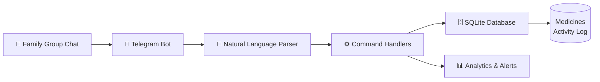
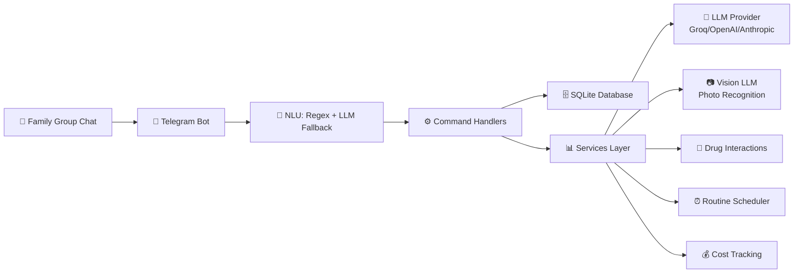

# 💊 Medi-Cabinet Bot

[](https://github.com/ahnaftanjid/medi-cabinet/actions/workflows/ci.yml)


> **A Telegram bot helping Bangladeshi families reduce medicine waste through smart inventory tracking**

## 📊 The Problem

In Bangladesh and many developing countries, medicine waste is a significant issue:
- Families buy medicines in bulk but forget about leftover stock
- Medicines expire unused, leading to financial loss
- Lack of simple tracking causes duplicate purchases
- Multi-generational households struggle with paper-based tracking

**Medi-Cabinet Bot** solves this by providing a zero-friction, natural language interface for families to track their medicine inventory right in their Telegram group chats.

## 🏗️ Architecture

### Phase 1: Current (MVP)


```mermaid
graph LR
    A[👥 Family Group Chat] --> B[🤖 Telegram Bot]
    B --> C[📝 Natural Language Parser]
    C --> D[⚙️ Command Handlers]
    D --> E[🗄️ SQLite Database]
    E --> F[(Medicines<br/>Activity Log)]
    D --> G[📊 Analytics & Alerts]
```

**Key Components:**
- **Natural Language Parser**: Understands commands like "Got Napa 10" or "Used 2 Napa"
- **Fuzzy Matching**: Handles typos and name variations (e.g., "Nappa" → "Napa")
- **Multi-Group Support**: Each family group has isolated data
- **Activity Logging**: Complete audit trail of all actions

### Full Architecture (Phases 1-5)


```mermaid
graph LR
    A[👥 Family Group Chat] --> B[🤖 Telegram Bot]
    B --> C[📝 NLU: Regex + LLM Fallback]
    C --> D[⚙️ Command Handlers]
    D --> E[🗄️ SQLite Database]
    D --> F[📊 Services Layer]
    F --> G[🧠 LLM Provider<br/>Groq/OpenAI/Anthropic]
    F --> H[📷 Vision LLM<br/>Photo Recognition]
    F --> I[💊 Drug Interactions]
    F --> J[⏰ Routine Scheduler]
    F --> K[💰 Cost Tracking]
```

**Key Components:**
- **Multi-Tier NLU**: Regex (Tier 1, free/fast) with LLM fallback (Tier 2, when configured)
- **LLM Factory**: Pluggable provider system — Groq (primary), OpenAI, Anthropic
- **Vision Processing**: Photo → LLM extraction → confirm → add to inventory
- **Routine Scheduler**: JobQueue-based alarms with Taken/Skip inline keyboards
- **Drug Interactions**: 30 common BD medicine interaction pairs with severity warnings
- **Cost Tracking**: Per-medicine spending, summaries, and analytics

## 🚀 Quick Start (5 Minutes)

### Prerequisites

- Python 3.10 or higher
- Telegram account
- 5 minutes of your time

### Setup

1. **Clone the repository**
   ```bash
   git clone https://github.com/ahnaftanjid/medi-cabinet.git
   cd medi-cabinet
   ```

2. **Install uv** (fast Python package installer)
   ```bash
   curl -LsSf https://astral.sh/uv/install.sh | sh
   ```

3. **Create your Telegram bot**
   - Open Telegram and search for [@BotFather](https://t.me/BotFather)
   - Send `/newbot` and follow instructions
   - Copy your bot token

4. **Configure environment**
   ```bash
   cp .env.example .env
   # Edit .env and paste your bot token
   ```

5. **Install dependencies and run**
   ```bash
   uv sync
   alembic upgrade head  # Initialize database
   uv run python run.py
   ```

6. **Start using the bot!**
   - Add your bot to a Telegram group
   - Send `/start` to see the welcome message
   - Start tracking: `+Napa 10`

## 📱 Usage Examples

### Adding Medicines

```
You: +Napa 10
Bot: ✅ Added Napa (10 tablets)
     📍 Total now: 10 tablets
```

```
You: Bought Napa Extra 20 tablets, expires Dec 2025
Bot: ✅ Added Napa Extra (20 tablets)
     ⚠️ Expiring in 300 days
```

### Using Medicines

```
You: -Napa 2
Bot: ✅ Used 2 tablets of Napa
     📍 Remaining: 8 tablets
```

```
You: Took some paracetamol
Bot: ✅ Used 1 tablet of Paracetamol
     📍 Remaining: 11 tablets
     ⚠️ Low stock! Only 2 left.
```

### Searching

```
You: ?Napa
Bot: 💊 Found: Napa
     Quantity: 8 tablets
     Added by: Ahnaf
     Added on: Today
```

```
You: Do we have Sergel?
Bot: 💊 Found: Sergel
     Quantity: 5 tablets
     Expiry: Expires Dec 2026
     Location: Bedroom Drawer
```

### Listing All Medicines

```
You: ?all
Bot: 💊 Medicine Cabinet (Total: 3)

     💊 Napa - 8 tablets
     💊 Napa Extra - 20 tablets (Expires Dec 2025)
     ⚠️ Sergel - 2 tablets

     ⚠️ Low Stock Alert!
     ⚠️ Sergel - Only 2 tablets left!
```

## 🎯 Command Reference

| Command | Example | Description |
|---------|---------|-------------|
| **Add Medicine** | `+Napa 10` | Add medicine to inventory |
| | `Bought Napa Extra 10 tablets` | Natural language add |
| | `Got paracetamol, 12, expires Dec 2025` | With expiry date |
| **Use Medicine** | `-Napa 2` | Use/consume medicine |
| | `Used 2 Napa` | Natural language use |
| | `Took some paracetamol` | "some" defaults to 1 |
| **Search** | `?Napa` | Search for specific medicine |
| | `Do we have Napa?` | Natural question |
| | `Check sergel` | Alternative search |
| **List All** | `?all` | List all medicines |
| | `list medicines` | Alternative list |
| | `inventory` | Show inventory |
| **Routines** | `/routine add Napa at 08:00 daily` | Set medicine reminders |
| | `/routine list` | View active routines |
| | `/routine pause 1` | Pause/resume a routine |
| **Interactions** | `/interactions Napa` | Check drug interactions |
| **Cost** | `/cost Napa 50` | Record medicine cost |
| | `/costs` | View cost summary |
| **Photo** | Send a photo | Auto-extract from medicine packet |
| **Analytics** | `/analytics` | Usage patterns & predictions |
| **Delete** | `/delete Napa` | Delete medicine (admin only) |
| **Statistics** | `/stats` | Show usage statistics |
| **Help** | `/help` | Show detailed help |

## 🛠️ Development

### Project Structure

```
medi-cabinet/
├── src/
│   ├── bot.py              # Main bot application & handler registration
│   ├── commands.py         # Command handlers (add, use, search, routine, cost, photo)
│   ├── parsers.py          # Multi-tier NLU (regex + routine + cost parsers)
│   ├── database.py         # Repository pattern (6 repos, 8 entity dataclasses)
│   ├── scheduler.py        # Routine alarm scheduling via JobQueue
│   ├── utils.py            # Formatting & validation helpers
│   ├── llm/                # LLM integration layer (see src/llm/README.md)
│   │   ├── base.py         # Abstract provider, LLMMessage, LLMResponse, ToolCall
│   │   ├── factory.py      # Registry-based provider factory
│   │   ├── parser.py       # Tier 2 LLM parser fallback
│   │   ├── tools.py        # Tool schemas for structured extraction
│   │   └── providers/      # Groq (full), OpenAI, Anthropic (placeholders)
│   └── services/           # Business logic (see src/services/README.md)
│       ├── routine_service.py
│       ├── interaction_service.py
│       ├── image_service.py
│       └── analytics_service.py
├── config/
│   └── config.py           # Configuration management (Pydantic)
├── data/
│   └── drug_interactions.json  # 30 BD medicine interaction pairs
├── migrations/
│   ├── env.py              # Alembic environment
│   └── versions/           # 4 migration files (001-004)
├── tests/                  # 170 tests (see tests/README.md)
│   ├── conftest.py         # Shared fixtures
│   ├── test_parsers.py     # Parser tests
│   ├── test_database.py    # Database tests
│   ├── test_utils.py       # Utility function tests
│   ├── test_llm/           # LLM layer tests
│   └── test_services/      # Service & repo tests
├── scripts/
│   └── seed_data.py        # Demo data seeding
├── docs/
│   ├── ARCHITECTURE.md     # Detailed architecture documentation
│   └── USER_GUIDE.md       # End-user guide
├── .env.example            # Environment variable template
├── pyproject.toml          # Project dependencies and config
├── alembic.ini             # Database migration config
├── Dockerfile              # Docker image definition
├── docker-compose.yml      # Docker orchestration
└── run.py                  # Entry point
```

### Running Tests

```bash
# Run all tests
uv run pytest

# Run with coverage
uv run pytest --cov=src --cov-report=html

# Run specific test file
uv run pytest tests/test_parsers.py -v
```

### Code Quality

```bash
# Format code
uv run black src/ tests/

# Lint code
uv run ruff check src/ tests/

# Type check
uv run mypy src/
```

## 🚢 Deployment

### Docker (Recommended)

1. **Build and run**
   ```bash
   docker-compose up -d
   ```

2. **Check logs**
   ```bash
   docker-compose logs -f bot
   ```

3. **Stop**
   ```bash
   docker-compose down
   ```

### Manual Deployment

1. **On a VPS (DigitalOcean, Linode, etc.)**
   ```bash
   # Clone repository
   git clone https://github.com/ahnaftanjid/medi-cabinet.git
   cd medi-cabinet

   # Install dependencies
   curl -LsSf https://astral.sh/uv/install.sh | sh
   uv sync

   # Configure
   cp .env.example .env
   # Edit .env with your bot token

   # Initialize database
   alembic upgrade head

   # Run with screen or tmux
   screen -S medi-bot
   uv run python run.py
   ```

2. **Using systemd (Linux)**
   Create `/etc/systemd/system/medi-cabinet.service`:
   ```ini
   [Unit]
   Description=Medi-Cabinet Telegram Bot
   After=network.target

   [Service]
   Type=simple
   User=your_user
   WorkingDirectory=/path/to/medi-cabinet
   ExecStart=/path/to/uv run python run.py
   Restart=always

   [Install]
   WantedBy=multi-user.target
   ```

   ```bash
   sudo systemctl enable medi-cabinet
   sudo systemctl start medi-cabinet
   ```

## ⚙️ Configuration

Edit `.env` file:

```bash
# Telegram Bot Token (from @BotFather)
TELEGRAM_BOT_TOKEN=your_bot_token_here

# Database Configuration
DATABASE_PATH=medi-cabinet.db

# Logging Level (DEBUG, INFO, WARNING, ERROR, CRITICAL)
LOG_LEVEL=INFO

# Admin User IDs (comma-separated, get from @userinfobot)
ADMIN_USER_IDS=123456789,987654321

# Medicine Tracking Settings
LOW_STOCK_THRESHOLD=3              # Alert when quantity < this
EXPIRY_WARNING_DAYS=30             # Warn when expiring within N days
FUZZY_MATCH_THRESHOLD=80           # Fuzzy matching sensitivity (0-100)

# LLM Integration (optional — leave empty to disable)
LLM_PROVIDER=groq                  # groq, openai, or anthropic
LLM_API_KEY=your-api-key
LLM_MODEL=llama-3.3-70b-versatile  # Model ID for the provider
LLM_TEMPERATURE=0.0

# Cost Tracking
DEFAULT_CURRENCY=BDT
```

## 🗺️ Roadmap

- [x] **Phase 1: Text-Based Tracking**
  - [x] Natural language command parsing
  - [x] Fuzzy medicine name matching
  - [x] Multi-group support with data isolation
  - [x] Activity logging and statistics
  - [x] Low stock and expiry alerts
  - [x] Docker deployment

- [x] **Phase 2: LLM Integration**
  - [x] Pluggable LLM providers (Groq, OpenAI, Anthropic)
  - [x] Factory pattern with auto-registration
  - [x] Tool calling for structured data extraction
  - [x] Tier 2 LLM fallback for ambiguous messages

- [x] **Phase 3: Image Processing**
  - [x] Vision LLM for medicine packet recognition
  - [x] Photo → extract → confirm → add flow
  - [x] Support for base64 and URL image inputs

- [x] **Phase 4: Smart Features**
  - [x] Drug interaction warnings (30 BD medicine pairs)
  - [x] Routine tracking with daily/weekly schedules
  - [x] Alarm reminders via JobQueue
  - [x] Before/after/with meal reminders
  - [x] Taken/Skip inline keyboard callbacks

- [x] **Phase 5: Analytics & Insights**
  - [x] Usage pattern analysis
  - [x] Restock predictions based on consumption rate
  - [x] Cost tracking per medicine
  - [x] Adherence statistics

## 🤝 Contributing

Contributions are welcome! Please feel free to submit a Pull Request.

1. Fork the repository
2. Create your feature branch (`git checkout -b feature/AmazingFeature`)
3. Commit your changes (`git commit -m 'Add some AmazingFeature'`)
4. Push to the branch (`git push origin feature/AmazingFeature`)
5. Open a Pull Request

### Development Guidelines

- Follow PEP 8 style guide
- Add type hints to all functions
- Write tests for new features
- Update documentation
- Run code quality checks before submitting

## 📄 License

This project is licensed under the MIT License - see the [LICENSE](LICENSE) file for details.

## 🙏 Acknowledgments

- Built with [python-telegram-bot](https://github.com/python-telegram-bot/python-telegram-bot)
- Database migrations with [Alembic](https://alembic.sqlalchemy.org/)
- Configuration with [Pydantic](https://docs.pydantic.dev/)
- Logging with [Loguru](https://github.com/Delgan/loguru)
- Package management with [uv](https://github.com/astral-sh/uv)

## 📞 Support

If you encounter any issues or have questions:
- Open an issue on [GitHub](https://github.com/ahnaftanjid/medi-cabinet/issues)
- Check the [ARCHITECTURE.md](docs/ARCHITECTURE.md) for technical details

---

**Made with ❤️ for Bangladeshi families | Portfolio project demonstrating clean architecture and practical problem-solving**
